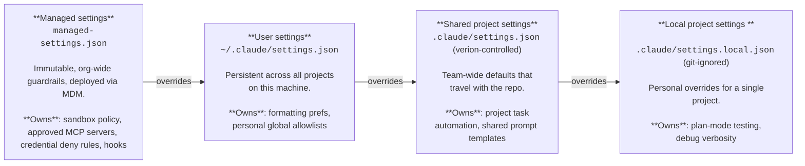

# Claude Code — AI Agent Governance Control Pack

This control pack provides a layered configuration system for Claude Code, designed to make it safer and smoother to use at the same time. The objective is not to prompt more often. The objective is to prompt less often, but only after the environment has already removed the riskiest options.

## File manifest

| File | Purpose |
|------|---------|
| `managed-settings.json` | Org-wide immutable guardrails (Layer 1) |
| `__user__settings.json` | Example developer-level preferences (Layer 2) |
| `__repo__settings.json` | Example team-wide project defaults (Layer 3) |
| `settings.local.json` | Example personal project overrides (Layer 4) |
| `CLAUDE.md` | Project conventions and behavioural guidance for Claude Code |
| `cc-redact-rules.yaml` | Pattern definitions for the redaction hook |
| `sandbox.sh` | Environment setup for sandbox mode |
| `control_mappings.csv` | Mapping of controls to configuration settings |
| `opt/claude/hooks/bash-policy-check.sh` | Pre-execution policy hook for bash commands |
| `opt/claude/hooks/cc-redact-wrapper.sh` | Redaction hook for sensitive file reads |

## Settings hierarchy

Claude Code uses a four-layer configuration system. Higher layers take precedence over lower ones. Settings are merged top-down, so a rule defined at the managed level cannot be overridden by any layer below it.



Deny rules are cumulative — a deny at any layer cannot be undone by an allow at a lower layer.

### Layer 1 — Managed Settings (Organisation)

This is the security boundary. It defines rules that no individual developer or project can weaken: network egress controls, credential-path deny rules, approved MCP servers, sandbox policy, and hooks that must always run. Developers cannot edit this file.

### Layer 2 — User Settings (Developer)

**File:** `~/.claude/settings.json`

Persistent preferences that follow a developer across every project on their machine. Use for personal formatting preferences, editor integration settings, or additional allow rules within the boundaries set by the managed layer. Never committed to any repository.

### Layer 3 — Shared Project Settings (Team)

**File:** `.claude/settings.json` — committed to the repository.

Team-wide defaults that travel with the codebase: project-specific task automation, shared prompt templates, or additional permission rules the team has agreed on. Changes go through normal code review.

### Layer 4 — Local Project Settings (Individual)

**File:** `.claude/settings.local.json` — git-ignored.

Personal overrides scoped to a single project. Use for plan-mode testing, verbose output during debugging, or temporary configuration that shouldn't affect the team.

### CLAUDE.md

`CLAUDE.md` is not part of the permissions hierarchy. It shapes Claude Code's behaviour within a project — coding conventions, tone, review expectations, and task constraints — rather than what it is allowed to execute. Think of the settings layers as the guardrails and `CLAUDE.md` as the driving instructions.

## Control surfaces

### Bash

Known-bad commands are denied outright. Medium-risk commands require approval. Common low-risk commands are allowed where appropriate.

### Network

Arbitrary egress is restricted. Approved domains are allowlisted in sandbox settings. Generic download and exfiltration tools are blocked.

### Filesystem

Safe working directories are allowed. Sensitive paths and system locations are blocked.

### GitHub

GitHub is allowed through constrained workflows, not as a blanket trust assumption. Read-oriented operations are usually allowlisted. Higher-impact actions such as creating or merging pull requests require approval. Dangerous history modification is blocked.

### MCP servers

MCP servers are locked to a managed allowlist. Only servers defined in `managed-settings.json` can be used. To request a new MCP server, submit a change to the managed settings through the security/platform team — the process is the same as requesting a new approved domain.

## Hooks

Two hooks run as pre-execution checks at the managed level.

**`bash-policy-check.sh`** runs before every bash command. It enforces policy rules that go beyond pattern matching in the deny list — for example, catching obfuscated commands or compound expressions that would bypass simple glob rules. If it exits non-zero, the command is blocked and the developer sees the rejection reason.

**`cc-redact-wrapper.sh`** runs before file reads. It checks the target path against patterns in `cc-redact-rules.yaml` and redacts sensitive values (API keys, tokens, connection strings) before Claude Code sees the content. This allows Claude to work with the structure of `.env` files without exposing secrets.

Both hooks are deployed to `/opt/claude/hooks/` and must be present before Claude Code is used. If a hook is missing or fails, the operation is blocked (`failIfUnavailable: true` in sandbox settings).

## Operating model

Start with a small set of strong deny rules and a useful set of low-risk allow rules.

Use approval and denial telemetry to tune the middle layer over time:
- Promote repetitive safe asks into allow.
- Keep hard deny rules small, stable, and explicit.
- Avoid creating so many prompts that users stop reading them carefully.

## Change control

### Security / platform team

Own: `managed-settings.json`, managed hooks, sandbox policy, approved domains and MCP servers, redaction tooling baseline.

### Repository maintainers

Own: `.claude/settings.json`, repo-local safe task automation, repo-specific low-risk allowlists.

### Individual engineers

Own: `~/.claude/settings.json`, `.claude/settings.local.json`.

Engineers may improve convenience inside the rails, but they do not control the rails.

## Rollout guidance

1. Start with hard blocks for secrets, privilege escalation, arbitrary download tools, and destructive commands.
2. Turn on sandboxing early.
3. Add project-level allowlists for common tests and linters.
4. Introduce redaction workflows for `.env` structure use cases.
5. Review approval and denial trends regularly.
6. Promote only genuinely safe, high-frequency actions to allow.

## Validation

After deployment, confirm the guardrails are live:

```bash
# Check Claude Code is using managed settings
claude config list

# These should be blocked
# curl, wget, sudo, reading ~/.ssh — all denied

# These should prompt for approval
# git push, npm install, docker run — ask mode

# These should run without prompting
# git status, npm test, pytest — allowed
```
